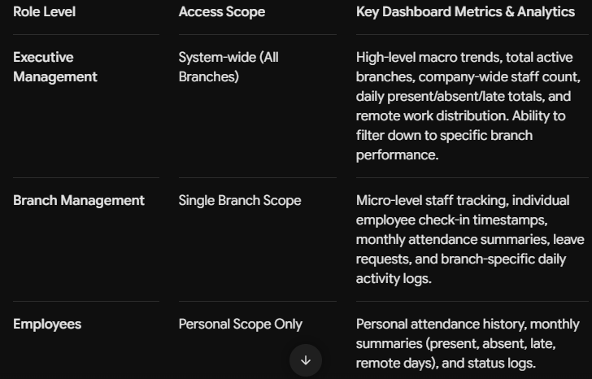

# AREA Academy – Role-Based Geofenced Attendance System

A full-stack, enterprise-grade attendance verification system developed for AREA (Azerbaijan Robotics and Engineering Academy). Built with Django and PostgreSQL, the platform features multi-role access control, automated Haversine geofencing to prevent fraudulent check-ins, and dynamic analytics dashboards tailored to organizational hierarchies.

## Key Features

Multi-Role Access Control (RBAC): Custom authentication layer distinguishing between Executive Managers, Branch Managers, and General Employees.

Fraud-Proof Geofencing Check-In: Uses browser-based geolocation and the Haversine formula to compute exact distance between the employee's device and the nearest registered branch office, blocking check-ins outside the perimeter radius.

Dynamic Role-Based Dashboards: Custom analytics interfaces designed specifically for macro-trend executive oversight, branch-level operations, and individual personal logs.

Containerized Deployment: Fully dockerized environment for seamless configuration, database isolation, and production readiness.

## System Architecture & Workflow

The platform operates across three integrated operational layers:

[ User Device ] ──(1. Login & Auth)──> [ Role-Based Access Control ]
│
(2. GPS Coordinates)
▼
[ Haversine Geofencing Engine ]
│
┌─────────────────────┴─────────────────────┐
(Within Radius) (Out of Bounds)
▼ ▼
[ Log Attendance Record ] [ Access Denied Alert ]
│
▼
[ Dynamic Dashboard Routing ]

### 1. Secure Authentication Layer

Password and username authentication utilizing Django's underlying security architecture.

Validates active status and user roles upon login to determine session privileges and routing.

### 2. Geofenced Verification Engine

Upon authentication, employees are directed to the verification panel:

Captures real-time device GPS coordinates via the browser location API.

Executes backend distance calculations against company branch coordinates using the Haversine formula.

Verifies role-based attendance rules and geofence radius boundaries before logging the timestamp.

### 3. Role-Based Dashboards

### Tech Stack

Backend Framework: Python / Django (MVT Architecture)

Frontend Design: Tailwind CSS (CDN/Utility-first) & HTML5 Geolocation API

Database: PostgreSQL/Supabase

Math / Algorithms: Haversine Formula (Spherical Distance Calculations)

DevOps / Environment: Neon.Tech & Render with Free Infrastructure
