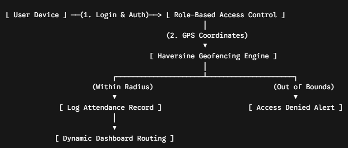
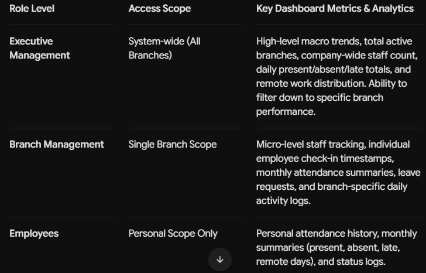

# AREA Academy – Role-Based Geofenced Attendance System

A full-stack, enterprise-grade attendance verification system developed for AREA (Azerbaijan Robotics and Engineering Academy). Built with Django and PostgreSQL, the platform features multi-role access control, automated Haversine geofencing to prevent fraudulent check-ins, and dynamic analytics dashboards tailored to organizational hierarchies.

## Key Features

Multi-Role Access Control (RBAC): Custom authentication layer distinguishing between Executive Managers, Branch Managers, and General Employees.

Geofenced Attendance Check-In: Uses browser-based geolocation and the Haversine formula to compute distance between the employee's device and the nearest registered branch office, blocking check-ins outside the perimeter radius. Passkey verification adds employee-specific authentication; GPS alone is not proof of identity or presence.

Dynamic Role-Based Dashboards: Custom analytics interfaces designed specifically for macro-trend executive oversight, branch-level operations, and individual personal logs.

Containerized Deployment: Fully dockerized environment for seamless configuration, database isolation, and production readiness.

## System Architecture & Workflow

The platform operates across three integrated operational layers:

### 1. Secure Authentication Layer

Username and password authentication followed by required WebAuthn/passkey verification for attendance application users, utilizing Django's underlying security architecture.

Validates active status and user roles upon login to determine session privileges and routing.

### 2. Geofenced Verification Engine

Upon authentication, employees are directed to the verification panel:

Captures real-time device GPS coordinates via the browser location API.

Executes backend distance calculations against company branch coordinates using the Haversine formula.

Verifies role-based attendance rules and geofence radius boundaries before logging the timestamp.

### 3. Role-Based Dashboards

### Passkey Verification for Attendance

Employees and branch managers must complete username/password login and verify a passkey on their personal device before they can use the attendance check-in flow. The passkey uses the device's biometric or screen-lock PIN; biometric data is not sent to or stored by this application. Browser-visible phone serial numbers and device fingerprints are not used.

Before enabling this flow in production, configure:

- `WEBAUTHN_RP_ID`: the application hostname or its registrable parent domain (for example, `attendance.example.com`).
- `WEBAUTHN_ORIGIN`: the exact application origin, including scheme and any non-default port (for example, `https://attendance.example.com`).
- `WEBAUTHN_RP_NAME`: the name shown by the browser when creating or using a passkey.

WebAuthn requires HTTPS in production; plain HTTP is supported only for local development on `localhost`. When `DEBUG` is false, missing relying-party configuration makes passkey operations fail closed. Set these variables in the deployment environment, not in source control.

#### First-time enrollment and recovery

1. A super administrator verifies the employee's identity in person, then selects the employee in Django Admin and uses **Issue passkey setup code**.
2. Give the one-time code directly to that employee. It expires after 30 minutes and is stored only as a digest.
3. The employee opens `/auth/passkeys/enroll/`, enters their username and code, and creates a passkey on their device.
4. To replace a lost device, a super administrator deletes the lost credential under **Passkey credentials**, verifies the employee again, then issues a fresh setup code.

An employee without a registered passkey cannot sign in to the attendance application. An un-enrolled super administrator can still sign in to the administrative dashboard to bootstrap enrollment, but cannot record attendance without passkey verification. Passkey-authenticated application sessions expire after 12 hours.

Passkeys can be synchronized between devices by the device platform, so this proves control of the employee's enrolled authenticator, not an unchangeable factory identity for one physical phone. The existing geofence remains an additional location signal and is not cryptographic proof of physical presence. A passkey also cannot prevent an employee from lending an unlocked device or approving a prompt for someone else.

### Monthly Attendance Analytics

Super admins can open Monthly Analytics from the admin dashboard to review and rank all branches. Branch managers can open the same month-by-month view for their assigned branch only. Use the month controls to browse completed months, and use the branch table filter and ranking selector to narrow the branch list.

Analytics are calculated from stored attendance records at request time; no background scheduler is required, and historical attendance is not deleted. A staff member's latest status is counted once per day. Attendance rate is the share of recorded statuses that are present, late, or remote; present and absent percentages are shown separately. Unrecorded workdays are not treated as absences. The existing branch detail dashboard shows this month's counts and rolls over automatically at the calendar-month boundary.

Time-of-day activity is grouped into morning, afternoon, and evening using the local check-in time. The system does not yet have scheduled shift assignments, so these groups indicate check-in activity rather than shift occupancy.

### Tech Stack

Backend Framework: Python / Django (MVT Architecture)

Frontend Design: Tailwind CSS (CDN/Utility-first) & HTML5 Geolocation API

Database: PostgreSQL/Supabase

Math / Algorithms: Haversine Formula (Spherical Distance Calculations)

DevOps / Environment: Neon.Tech & Render with Free Infrastructure
